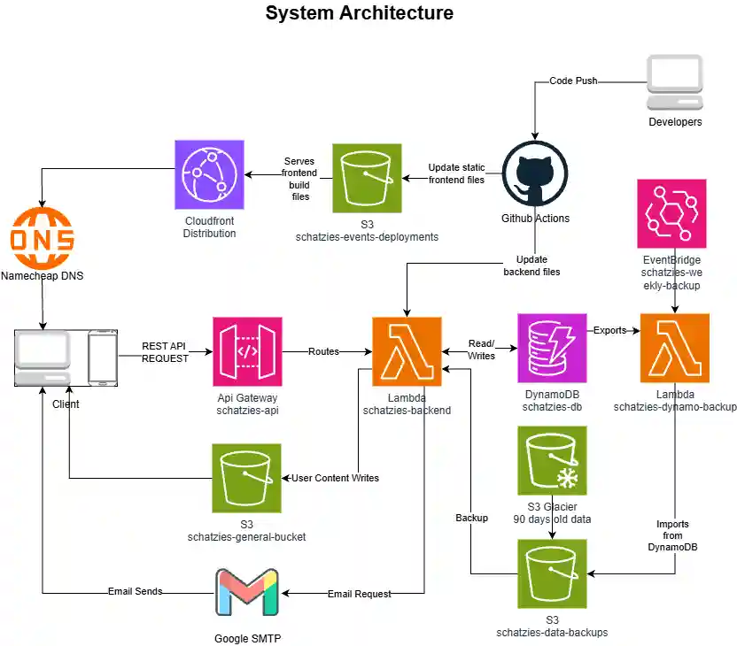

# Schatzies Events - CloudFormation



This template defines the core AWS infrastructure for Schatzies Events. The diagram shows the main runtime flow: the frontend is deployed to S3 and served through CloudFront, API requests go through API Gateway to the backend Lambda, application data is stored in DynamoDB, user-uploaded or generated content is stored in S3, and a scheduled backup Lambda copies DynamoDB data into an S3 backup bucket with lifecycle archival to Glacier.

## What This Stack Creates

- A deployment S3 bucket for static frontend assets, fronted by CloudFront with Origin Access Control
- A general-purpose S3 bucket for application content
- A versioned S3 backup bucket with a lifecycle rule that transitions older backups to Glacier after 90 days
- A CloudFront distribution that serves the SPA and forwards `/api/*` traffic to API Gateway
- An HTTP API Gateway with a `$default` route to the backend Lambda
- A `schatzies-backend` Lambda function
- A `schatzies-dynamo-backup` Lambda function scheduled weekly by EventBridge
- A DynamoDB table named `schatzies_main_table` with `PK` / `SK` keys and an `email-index` GSI
- IAM roles, a shared managed policy, and scoped IAM users for local development and GitHub Actions

## Architecture Notes

- Frontend assets are stored in a private deployment bucket and accessed through CloudFront only.
- CloudFront is configured for SPA routing by returning `index.html` for `403` and `404` responses.
- `/api/*` requests are sent through CloudFront to the HTTP API, which invokes the backend Lambda.
- The backend Lambda has read/write access to the main DynamoDB table and the general S3 bucket.
- The backup Lambda scans the DynamoDB table on a weekly schedule and writes JSON backups into the backup bucket.
- The backup bucket is versioned and automatically archives older backup objects to Glacier.
- The template does not store credentials, access keys, certificates, or other secrets in source control.

## Deployment Notes

Deploy the stack with named IAM capability enabled:

```bash
aws cloudformation deploy \
  --template-file cloudformation.yaml \
  --stack-name schatzies-events \
  --capabilities CAPABILITY_NAMED_IAM
```

## Outputs

The stack exports values for:

- Frontend website URL
- API endpoint
- Backend Lambda function name
- DynamoDB table name
- Deployment bucket name
- General bucket name
- Backup bucket name
- Backup Lambda function name
- CloudFront distribution ID and domain name

## Important Scope Notes

- Custom domain aliases and the ACM certificate for the live CloudFront distribution are handled outside this template.
- The Lambda code embedded in this template is minimal bootstrap code; production application code may be updated separately after stack creation.
